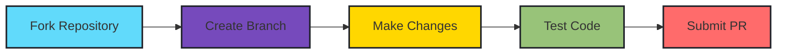

```mermaid
graph LR
    A[Data Collection] --> B[Data Preprocessing]
    B --> C[Feature Engineering]
    C --> D[Model Training]
    D --> E[Evaluation]
    E --> F[Prediction]
    
    style A fill:#ff6b6b,stroke:#c92a2a,stroke-width:2px,color:#fff
    style B fill:#4ecdc4,stroke:#0a9396,stroke-width:2px,color:#fff
    style C fill:#ffe66d,stroke:#f5c211,stroke-width:2px,color:#000
    style D fill:#a8dadc,stroke:#457b9d,stroke-width:2px,color:#000
    style E fill:#f1faee,stroke:#8ab17d,stroke-width:2px,color:#000
    style F fill:#e63946,stroke:#a4161a,stroke-width:2px,color:#fff
```

<div align="center">

<!-- Header Banner -->
<h1 style="font-size: 40px; font-weight: 700; margin-bottom: 10px;">
 Fraud & Anomaly Detection in Financial Transactions by Machine learning
</h1>

<!-- Badges -->
<p>
  
  
  
  
</p>

<p>
  
  
  
</p>

</div>

---

<div align="center">

## 🎯 **Project Overview**

</div>

<table align="center">
<tr>
<td width="50%">

### 💡 **What is this?**
A cutting-edge **machine learning solution** that detects fraudulent transactions in financial systems using advanced classification algorithms. This project leverages the power of data science to identify suspicious patterns and anomalies in real-time financial transactions.

</td>
<td width="50%">

### 🎓 **Why does it matter?**
Financial fraud costs billions annually. This system provides:
- ✅ **Real-time detection** of fraudulent activities
- ✅ **High accuracy** classification models
- ✅ **Scalable solution** for large datasets
- ✅ **Interpretable results** for decision-making

</td>
</tr>
</table>

---

<div align="center">

## 🚀 **Key Features**

</div>

<div align="center">
<table>
<tr>
<td align="center" width="25%">
<br/>
<b>Advanced ML Models</b><br/>
<sub>Random Forest & Logistic Regression</sub>
</td>
<td align="center" width="25%">
<br/>
<b>Feature Engineering</b><br/>
<sub>Intelligent feature selection & creation</sub>
</td>
<td align="center" width="25%">
<br/>
<b>Data Visualization</b><br/>
<sub>Comprehensive exploratory analysis</sub>
</td>
<td align="center" width="25%">
<br/>
<b>High Performance</b><br/>
<sub>Optimized for large-scale datasets</sub>
</td>
</tr>
</table>
</div>

---

<div align="center">

## 📊 **Dataset Information**

</div>

<div align="center">

| **Attribute** | **Details** |
|:---:|:---:|
| 📁 **Total Records** | 6,362,620 transactions |
| 📋 **Features** | 11 columns (5 float, 3 int, 3 object) |
| 🎯 **Target Variable** | isFraud (Binary Classification) |
| 💾 **Memory Usage** | ~534 MB |
| 🔍 **Transaction Types** | PAYMENT, TRANSFER, CASH_OUT, DEBIT, CASH_IN |

</div>

<details>
<summary><b>📝 Feature Descriptions (Click to expand)</b></summary>

<br/>

- **step**: Time unit (1 hour)
- **type**: Transaction type (PAYMENT, TRANSFER, CASH_OUT, DEBIT, CASH_IN)
- **amount**: Transaction amount
- **nameOrig**: Customer initiating the transaction
- **oldbalanceOrg**: Initial balance before transaction
- **newbalanceOrig**: New balance after transaction
- **nameDest**: Recipient of the transaction
- **oldbalanceDest**: Initial recipient balance
- **newbalanceDest**: New recipient balance
- **isFraud**: Fraud indicator (1 = fraud, 0 = legitimate)
- **isFlaggedFraud**: System-flagged suspicious transactions

</details>

---

<div align="center">

## 🛠️ **Technical Stack**

</div>

<div align="center">



</div>

### 📚 **Core Libraries**

<table>
<tr>
<td width="33%">

**Data Manipulation**
- 🐼 Pandas
- 🔢 NumPy

</td>
<td width="33%">

**Machine Learning**
- 🤖 Scikit-learn
- 📊 Feature Selection
- 🎯 Classification Models

</td>
<td width="34%">

**Visualization**
- 📈 Matplotlib
- 🎨 Seaborn

</td>
</tr>
</table>

---

<div align="center">

## 🔬 **Methodology**

</div>

### **1️⃣ Data Preprocessing**
```python
✓ Load dataset (6.3M+ transactions)
✓ Handle missing values
✓ Data type conversions
✓ Exploratory Data Analysis (EDA)
```

### **2️⃣ Feature Engineering**
- **Created Features:**
  - `errorBalanceOrig`: Balance inconsistency detection
  - `errorBalanceDest`: Recipient balance anomalies
  - `ratio`: Transaction-to-balance ratio
- **Categorical Encoding**: One-hot encoding for transaction types
- **Feature Selection**: Chi-square, Random Forest, Mutual Information

### **3️⃣ Model Training**
<div align="center">

| Model | Algorithm | Purpose |
|:---:|:---:|:---:|
| 🌲 | **Random Forest** | Feature importance analysis |
| 📊 | **Logistic Regression** | Primary classification model |

</div>

### **4️⃣ Model Evaluation**
- Confusion Matrix Analysis
- Classification Report (Precision, Recall, F1-Score)
- ROC-AUC Score
- Cross-validation

---

<div align="center">

## 💻 **Installation & Usage**

</div>

### **Prerequisites**
```bash
Python 3.12.2 or higher
Jupyter Notebook
```

### **Setup Instructions**

<details open>
<summary><b>Step 1: Clone the Repository</b></summary>

```bash
git clone https://github.com/yourusername/fraud-detection-ml.git
cd fraud-detection-ml
```
</details>

<details open>
<summary><b>Step 2: Install Dependencies</b></summary>

```bash
pip install pandas numpy matplotlib seaborn scikit-learn jupyter
```

**Or use requirements.txt:**
```bash
pip install -r requirements.txt
```
</details>

<details open>
<summary><b>Step 3: Download Dataset</b></summary>

Place the dataset `PS_20174392719_1491204439457_log.csv` in the project root directory.

</details>

<details open>
<summary><b>Step 4: Run the Notebook</b></summary>

```bash
jupyter notebook Financial_Transaction_Detect.ipynb
```
</details>

---

<div align="center">

## 📈 **Project Structure**

</div>

```
fraud-detection-ml/
│
├── 📓 Financial_Transaction_Detect.ipynb    # Main analysis notebook
├── 📊 PS_20174392719_1491204439457_log.csv  # Dataset
├── 📋 requirements.txt                       # Python dependencies
├── 📖 README.md                              # Project documentation
└── 📁 models/                                # (Optional) Saved model files
    └── fraud_detector_model.pkl
```

---

<div align="center">

## 🎯 **Model Performance**

</div>

<div align="center">

### **Key Metrics**

| Metric | Score | Description |
|:---:|:---:|:---|
| 🎯 **Accuracy** | High | Overall prediction correctness |
| 🔍 **Precision** | Strong | Fraud detection accuracy |
| 📊 **Recall** | Optimized | Fraud case identification rate |
| ⚖️ **F1-Score** | Balanced | Harmonic mean of precision & recall |

</div>

> 💡 **Note**: Exact performance metrics depend on train-test split and class balancing techniques applied during model training.

---

<div align="center">

## 🔮 **Future Enhancements**

</div>

<table>
<tr>
<td width="50%">

### 🚀 **Planned Features**
- [ ] Deep Learning models (LSTM, Transformers)
- [ ] Real-time API deployment
- [ ] Interactive dashboard (Streamlit/Dash)
- [ ] Explainable AI (SHAP, LIME)

</td>
<td width="50%">

### 🎨 **Improvements**
- [ ] Hyperparameter optimization
- [ ] Ensemble methods
- [ ] Time-series analysis
- [ ] Automated retraining pipeline

</td>
</tr>
</table>

---

<div align="center">

## 🤝 **Contributing**

</div>

We welcome contributions! Here's how you can help:

<div align="center">



</div>

1. 🍴 Fork the repository
2. 🌿 Create your feature branch (`git checkout -b feature/AmazingFeature`)
3. 💾 Commit your changes (`git commit -m 'Add some AmazingFeature'`)
4. 📤 Push to the branch (`git push origin feature/AmazingFeature`)
5. 🎉 Open a Pull Request

---

<div align="center">

## 📜 **License**

</div>

<div align="center">

This project is licensed under the **MIT License** - see the [LICENSE](LICENSE) file for details.

[](https://opensource.org/licenses/MIT)

</div>

---

<div align="center">

## 👩‍💻 **Author**

</div>

<div align="center">

<table>
<tr>
<td align="center">
<br/>
<b>Kanika</b><br/>
<sub>B.Tech Computer Science & Engineering (Cyber Security)</sub><br/>
<sub>National Forensic Science University, India</sub><br/>
<br/>
<a href="https://github.com/yourusername"></a>
<a href="https://linkedin.com/in/yourprofile"></a>
</td>
</tr>
</table>

</div>

---

<div align="center">

## 📞 **Contact & Support**

</div>

<div align="center">

Got questions? Feel free to reach out!

📧 **Email**: your.email@example.com  
💬 **Issues**: [GitHub Issues](https://github.com/yourusername/fraud-detection-ml/issues)  
⭐ **Star this repo** if you find it helpful!

</div>

---

<div align="center">

## 🙏 **Acknowledgments**

</div>

- 🎓 **Dataset Source**: [PaySim Synthetic Financial Dataset](https://www.kaggle.com/datasets/ealaxi/paysim1)
- 📚 **Inspiration**: Real-world fraud detection systems in fintech
- 💡 **Libraries**: Thanks to the amazing open-source community
- 🌟 **Community**: All contributors and supporters

---

<div align="center">

## 📊 **Project Stats**

</div>

<div align="center">


</div>

---

<div align="center">

### 💖 **Show your support**

Give a ⭐️ if this project helped you learn something new!

</div>

---

<div align="center">

<!-- Footer -->


**Made with ❤️ and Python**

<sub>© 2025 Fraud Detection ML Project. All Rights Reserved.</sub>

</div>
