<!-- Header Banner -->
<h1 style="font-size: 40px; font-weight: 700; margin-bottom: 10px;">
 Fraud & Anomaly Detection in Financial Transactions by Machine learning
</h1>

<!-- Badges -->

  
  
  

---

## 🎯 **Project Overview**

A machine learning project that detects fraudulent financial transactions using 
feature engineering, Chi-Square feature selection, and Logistic Regression.

## 🚀 **Key Features**

<table>
<tr>
<td align="center" width="25%">
<b>Data cleaning</b> 
Improve dataset quality and reliability
</td>
<td align="center" width="25%">
<b>Feature selection</b> 
Improve a machine learning model's performance
</td>
<td align="center" width="25%">
<b>Feature Engineering</b> 
Improve the performance of machine learning models
</td>
<td align="center" width="25%">
<b>Model training </b> 
Find patterns and make predictions using Logistic Regression
</td>
</tr>
</table>

---

## 📊 **Dataset Information**

This project uses the <strong>PaySim Financial Transaction Simulation Dataset</strong>, a widely used dataset for fraud detection research.
<a href="https://www.kaggle.com/datasets/ealaxi/paysim1" target="_blank">
PaySim1 – Financial Transactions Dataset (Kaggle)

 
| **Attribute** | **Details** |
|:---:|:---:|
| **Total Records** | 6,362,620 transactions |
| **Features** | 11 columns (5 float, 3 int, 3 object) |
| **Target Variable** | isFraud (Binary Classification) |
| **Legitimate (Class 0)** | 6,354,407 |
| **Fraudulent (Class 1)** | 8,213 |
| **Memory Usage** | ~534 MB |

---

## **Technical Stack**

```mermaid
graph LR
    A[Data Collection] --> B[Data Preprocessing]
    B --> C[Feature Engineering]
    C --> D[Model Training]
    D --> E[Evaluation]
    E --> F[Prediction]
    
    style A fill:#ff6b6b,stroke:#c92a2a,stroke-width:2px,color:#fff
    style B fill:#4ecdc4,stroke:#0a9396,stroke-width:2px,color:#fff
    style C fill:#ffe66d,stroke:#f5c211,stroke-width:2px,color:#000
    style D fill:#a8dadc,stroke:#457b9d,stroke-width:2px,color:#000
    style E fill:#f1faee,stroke:#8ab17d,stroke-width:2px,color:#000
    style F fill:#e63946,stroke:#a4161a,stroke-width:2px,color:#fff
```

<!-- Footer -->

**Made with ❤️ and Python**

© 2025 Fraud Detection ML Project. All Rights Reserved.

